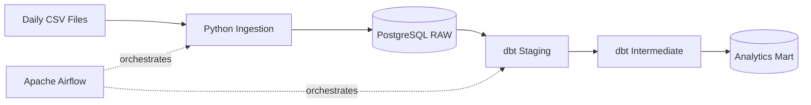
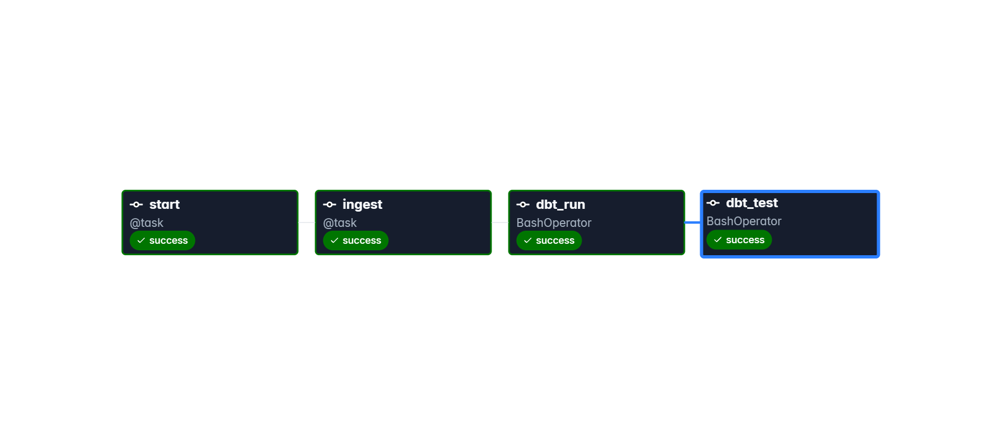

# Sales Data Engineering Pipeline

End-to-end batch data pipeline built with open-source technologies to simulate a real-world sales data ingestion and transformation workflow.

The project ingests daily CSV files, loads raw data into PostgreSQL, transforms the data using dbt, validates data quality, and orchestrates the complete workflow with Apache Airflow.

---

## Architecture



### Pipeline Flow

1. Daily sales CSV files are placed in the landing area.
2. Python reads and validates the source files.
3. Valid records are loaded into PostgreSQL.
4. dbt transforms raw data into analytical models.
5. dbt tests validate data quality.
6. Apache Airflow orchestrates the complete workflow.

---

## Tech Stack

| Technology | Purpose |
|---|---|
| Python | Data ingestion and validation |
| PostgreSQL 16 | Raw and analytical data storage |
| dbt Core | SQL transformations and data quality tests |
| Apache Airflow 3 | Pipeline orchestration |
| Docker / Docker Compose | Reproducible local environment |
| Git | Source control |

---

## Airflow Pipeline

The pipeline is orchestrated through Apache Airflow using the following DAG:

```text
start
  │
  ▼
ingest
  │
  ▼
dbt_run
  │
  ▼
dbt_test
```

Each task has a specific responsibility:

- **start** — initializes the pipeline execution.
- **ingest** — processes the available sales CSV files and loads them into PostgreSQL.
- **dbt_run** — executes the dbt transformation models.
- **dbt_test** — runs data quality tests against the transformed models.

### Airflow DAG Execution



---

## Data Architecture

The project follows an ELT-oriented layered architecture:

```text
CSV Files
    │
    ▼
Landing
    │
    ▼
PostgreSQL
    │
    ├── RAW
    │
    ▼
dbt
    │
    ├── Staging
    ├── Intermediate
    └── Analytics Mart
```

### Raw Layer

Stores source data with minimal transformation, preserving the original information received from the CSV files.

### Staging Layer

Standardizes column names, data types and prepares the raw data for downstream transformations.

### Intermediate Layer

Contains reusable business transformations used to construct analytical models.

### Analytics Mart

Provides business-ready datasets optimized for analytical queries and reporting.

---

## Project Structure

```text
sales-data-pipeline-os/
│
├── airflow/
│   └── dags/
│       └── sales_pipeline.py
│
├── data/
│   └── ...
│
├── docker/
│   └── airflow/
│       ├── Dockerfile
│       └── dbt/
│           └── sales_dw/
│
├── ingestion/
│   ├── __init__.py
│   ├── database.py
│   ├── extract.py
│   ├── loader.py
│   └── main.py
│
├── sql/
│   └── init.sql
│
├── tests/
│
├── docker-compose.yml
├── pyproject.toml
├── .env.example
└── README.md
```

---

## Running the Project

### Requirements

Make sure the following tools are installed:

- Docker
- Docker Compose
- Git

Clone the repository:

```bash
git clone https://github.com/Alissonfersoa/sales-data-pipeline-os.git

cd sales-data-pipeline-os
```

Create the environment configuration:

```bash
cp .env.example .env
```

Start the environment:

```bash
docker compose up -d
```

Check the containers:

```bash
docker compose ps
```

Access Apache Airflow:

```text
http://localhost:8080
```

Trigger the `sales_data_pipeline` DAG through the Airflow interface.

---

## Data Quality

Data quality checks are executed using dbt tests after the transformation stage.

The Airflow pipeline only completes successfully when:

```text
ingestion
    ↓
dbt transformations
    ↓
dbt tests
    ↓
SUCCESS
```

This prevents the pipeline from reporting a successful execution when transformation or quality checks fail.

---

## Engineering Concepts

This project demonstrates practical Data Engineering concepts including:

- Batch data ingestion
- ELT architecture
- Idempotent file processing
- Layered data modeling
- Data quality testing with dbt
- Workflow orchestration with Apache Airflow
- PostgreSQL data warehousing
- Containerized development with Docker
- Separation between ingestion, orchestration and transformation layers

---

## Idempotency

The ingestion layer was designed to support idempotent execution.

Previously processed data can be re-evaluated without creating unintended duplicate records in the target database.

This behavior was validated by executing additional pipeline runs and checking the resulting data directly in PostgreSQL using DBeaver.

---

## Database Validation

Pipeline results were validated directly in PostgreSQL using DBeaver.

This validation was used to confirm:

- successful ingestion of new CSV files
- persistence of loaded records
- correct transformation flow
- idempotent behavior across repeated executions

--- 

## Author

**Alisson Batista**

Data Engineering portfolio project focused on building production-inspired data pipelines using open-source technologies.